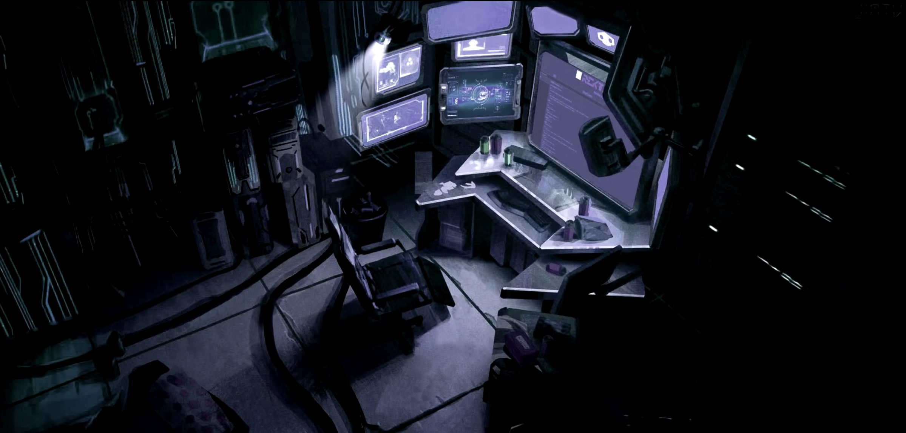

# OverTheWire
[overthewire.org](https://overthewire.org/)  
[Music](https://www.youtube.com/watch?v=72LUL1hhXdc)


```shell
sudo apt-get install sshpass
# sshpass -p your_password ssh user@hostname
```
### [Bandit](https://overthewire.org/wargames/bandit/)
[Level 0](https://overthewire.org/wargames/bandit/bandit0.html)

```shell
sshpass -p bandit0 ssh bandit0@bandit.labs.overthewire.org -p 2220
```

[Level 1](https://overthewire.org/wargames/bandit/bandit1.html)

```shell
sshpass -p bandit0 ssh bandit0@bandit.labs.overthewire.org -p 2220
cat readme 
```

[Level 2](https://overthewire.org/wargames/bandit/bandit2.html)

```shell
sshpass -p NH2SXQwcBdpmTEzi3bvBHMM9H66vVXjL ssh bandit1@bandit.labs.overthewire.org -p 2220
cat ./-
```

[Level 3](https://overthewire.org/wargames/bandit/bandit3.html)

```shell
sshpass -p rRGizSaX8Mk1RTb1CNQoXTcYZWU6lgzi ssh bandit2@bandit.labs.overthewire.org -p 2220
cat "spaces in this filename"
```

[Level 4](https://overthewire.org/wargames/bandit/bandit4.html)

```shell
sshpass -p aBZ0W5EmUfAf7kHTQeOwd8bauFJ2lAiG ssh bandit3@bandit.labs.overthewire.org -p 2220
cat inhere/.hidden
```

[Level 5](https://overthewire.org/wargames/bandit/bandit5.html)

```shell
sshpass -p 2EW7BBsr6aMMoJ2HjW067dm8EgX26xNe ssh bandit4@bandit.labs.overthewire.org -p 2220
find -maxdepth 2 -type f ! -name "*.*" -exec grep -lvIP '[^[:ascii:]]' {} +
#./inhere/-file09
#./inhere/-file07 <<<
cat ./inhere/-file07
```

[Level 6](https://overthewire.org/wargames/bandit/bandit6.html)

```shell
sshpass -p lrIWWI6bB37kxfiCQZqUdOIYfr6eEeqR ssh bandit5@bandit.labs.overthewire.org -p 2220
find . -type f -size 1033c -exec cat {} +
```

[Level 7](https://overthewire.org/wargames/bandit/bandit7.html)

```shell
sshpass -p P4L4vucdmLnm8I7Vl7jG1ApGSfjYKqJU ssh bandit6@bandit.labs.overthewire.org -p 2220
find / -size 33c -user bandit7 -group bandit6 -exec cat {} +
```

[Level 8](https://overthewire.org/wargames/bandit/bandit8.html)

```shell
sshpass -p z7WtoNQU2XfjmMtWA8u5rN4vzqu4v99S ssh bandit7@bandit.labs.overthewire.org -p 2220
grep -n "millionth" data.txt
```

[Level 9](https://overthewire.org/wargames/bandit/bandit9.html)

```shell
sshpass -p TESKZC0XvTetK0S9xNwm25STk5iWrBvP ssh bandit8@bandit.labs.overthewire.org -p 2220
sort data.txt | uniq -u
```

[Level 10](https://overthewire.org/wargames/bandit/bandit10.html)

```shell
sshpass -p EN632PlfYiZbn3PhVK3XOGSlNInNE00t ssh bandit9@bandit.labs.overthewire.org -p 2220
# todo
```

[Level 11](https://overthewire.org/wargames/bandit/bandit11.html)

```shell
sshpass -p G7w8LIi6J3kTb8A7j9LgrywtEUlyyp6s ssh bandit10@bandit.labs.overthewire.org -p 2220
base64 --decode data.txt 
```

[Level 12](https://overthewire.org/wargames/bandit/bandit12.html)

```shell
sshpass -p 6zPeziLdR2RKNdNYFNb6nVCKzphlXHBM ssh bandit11@bandit.labs.overthewire.org -p 2220
```
